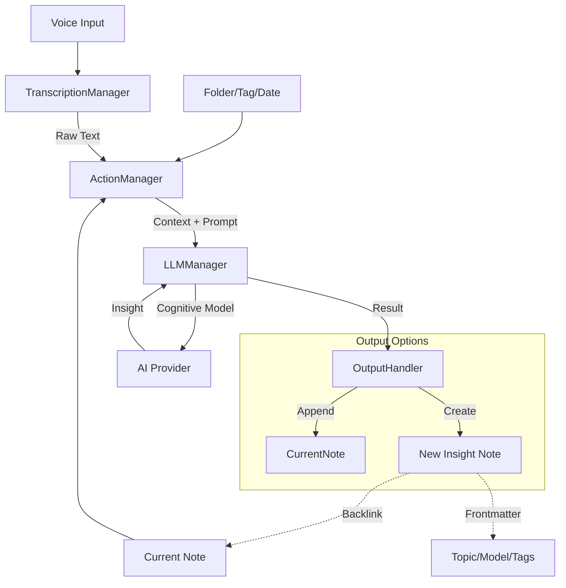

# Architecture & Development Guide

## Overview
This plugin has evolved into a modular **AI Intelligence Platform** for Obsidian. It orchestrates three main capabilities:
1.  **Audio Ingestion (ASR)**: Capturing raw thoughts.
2.  **Text Refinement (LLM)**: Polishing and structuring text.
3.  **Cognitive Actions (Agents)**: Applying mental models and batch processing to notes.

## Core Components

### 1. Managers
Managers are the central nervous system of the plugin.

*   **`TranscriptionManager`**:
    *   **Role**: Handles the physical world (Audio).
    *   **Responsibilities**: Audio validation, chunking, and routing to ASR providers (Zhipu, Volcengine).

*   **`LLMManager`**:
    *   **Role**: Handles the cognitive world (Intelligence).
    *   **Responsibilities**:
        *   Unified interface for all LLM providers (OpenAI, Gemini, Claude, Minimax, etc.).
        *   Manages context window limitations and API configurations.

*   **`ActionManager` (The Brain)**:
    *   **Role**: Orchestrates "AI Emergence" workflows.
    *   **Responsibilities**:
        *   **Registry**: Maintains the library of cognitive actions (e.g., "Socratic Questioning", "Master Debate").
        *   **Context Resolution**: Determines what data to process (Current Note, Selection, Folder, Tag, or Date Range).
        *   **Batch Processing**: Aggregates content from multiple files (e.g., `fetchFilesByTag`, `combineFilesContent`) to allow high-level analysis.
        *   **Output Handling**: Generates new "Insight Notes" with specialized frontmatter (`topic`, `tags`) and backlinks to sources.

### 2. Services
Low-level implementations of external APIs.

*   `src/services/transcription/`: ASR adapters (Volcengine, Zhipu).
*   `src/services/llm/`: LLM adapters (OpenAI-compatible, Gemini, etc.).
*   `src/services/audio-recorder.ts`: Browser MediaRecorder wrapper.
*   `src/services/text-inserter.ts`: Helper for Editor manipulation.

### 3. UI Components

*   **`AISidebarView`**: The command center for triggering Thinking Actions.
*   **`RecordingModal`**: The interface for voice capture.
*   **`TimeRangeModal` / `TagSelectionModal`**: UI for selecting batch processing contexts.

## Data Flow: The "Emergence" Pipeline

## Adding New Capabilities

### Adding a Thinking Action
1.  Open `src/managers/action-manager.ts`.
2.  Define a new `AIAction` object in `loadDefaultActions()`.
    *   Choose a category (or create new).
    *   Define `systemPrompt`: This is where the "cognitive model" lives.
    *   Define `outputMode`: Usually `new-note` for deep analysis.
3.  The UI updates automatically.

### Adding Providers
*   **LLM**: `src/services/llm/` + `LLMManager` registration.
*   **ASR**: `src/services/transcription/` + `TranscriptionManager` registration.