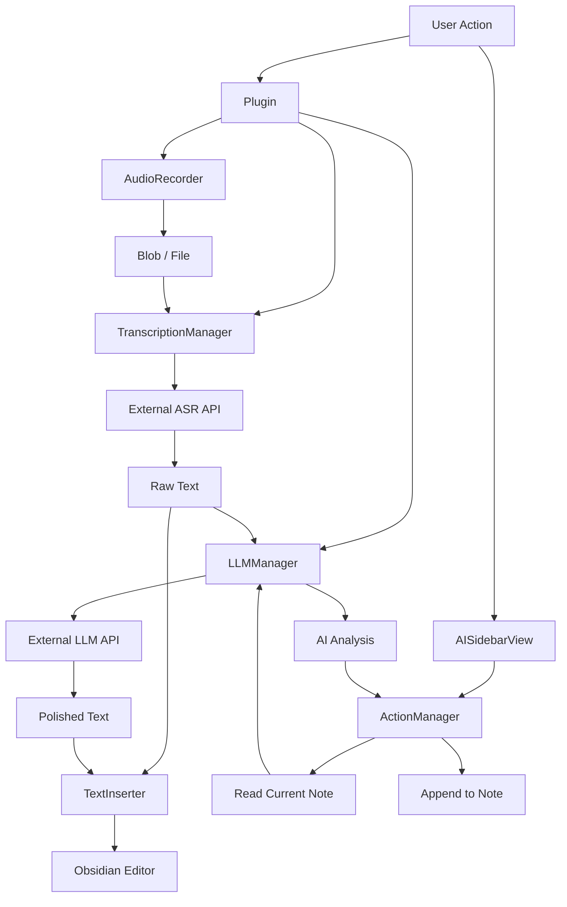

# Architecture & Development Guide

## Overview
This plugin is built as a modular **Audio Intelligence Platform** for Obsidian. It decouples the *capability* of transcribing audio and generating text from the *features* that user interacts with.

## Core Components

### 1. Managers
Managers are high-level orchestrators that abstract the complexity of underlying services.

*   **`TranscriptionManager`**:
    *   **Role**: Handles all speech-to-text operations.
    *   **Responsibilities**:
        *   Instantiates the correct provider (Zhipu, Volcengine, etc.).
        *   Checks file constraints (max size, duration).
        *   Handles chunking logic for long audio files.
        *   Standardizes error reporting.

*   **`LLMManager`**:
    *   **Role**: Handles all text-generation/chat operations.
    *   **Responsibilities**:
        *   Instantiates the correct LLM provider (OpenAI, Gemini, Claude, etc.).
        *   Provides a unified `complete(messages)` interface.
        *   Manages API keys and connection settings centrally.

*   **`ActionManager`** (New):
    *   **Role**: Manages the registry of "AI Actions" (shortcuts).
    *   **Responsibilities**:
        *   Stores available actions (e.g., "Value Clarification").
        *   Executes actions by fetching note content, calling `LLMManager`, and handling the output (append/replace).

### 2. Services
Services are low-level implementations of specific API providers.

*   `src/services/transcription/`: Contains implementations like `ZhipuTranscriptionService`.
*   `src/services/llm/`: Contains implementations like `OpenAICompatibleLLMService`, `GeminiLLMService`.
*   `AudioRecorder`: Wraps the browser's MediaRecorder API.

### 3. UI Components

*   **`AISidebarView`** (`src/ui/sidebar/`):
    *   A custom ItemView that lives in the Obsidian Right Sidebar.
    *   Displays categories of AI Actions.
    *   Triggers `ActionManager.executeAction()` on click.

### 4. Features (Workflows)
Features combine Managers and Services to deliver value.

*   **Transcription**: The basic flow of Audio -> Text.
*   **AI Polishing**: The flow of Audio -> Text -> LLM Polish -> Final Text.
*   **AI Sidebar Shortcuts**: The flow of Current Note -> LLM Action -> Append Result.

## Data Flow

## Adding a New Provider

### Adding an LLM Provider
1.  Define the provider enum in `src/types/config.ts`.
2.  Create a service class in `src/services/llm/` implementing `LLMService`.
3.  Register it in `LLMServiceFactory` (or `LLMManager`).
4.  Add settings UI in `src/ui/settings-tab.ts`.

### Adding an ASR Provider
1.  Define the provider enum in `src/types/config.ts`.
2.  Create a service class in `src/services/transcription/` implementing `TranscriptionService`.
3.  Register it in `TranscriptionServiceFactory` (or `TranscriptionManager`).
4.  Add settings UI in `src/ui/settings-tab.ts`.

### Adding a New AI Action
1.  Edit `src/managers/action-manager.ts`.
2.  Add a new entry to the `categories` list in `loadDefaultActions()`.
3.  Define the `systemPrompt`, `name`, and `description`.